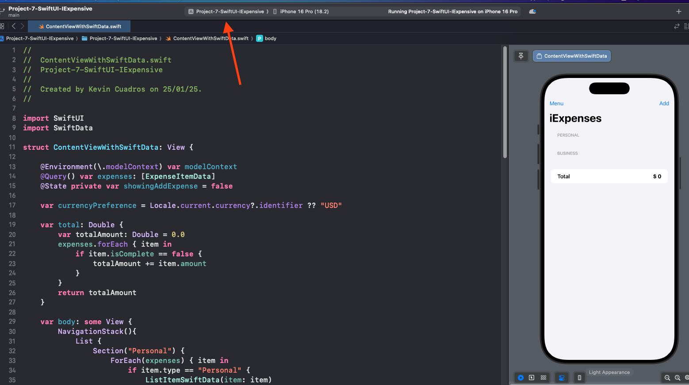
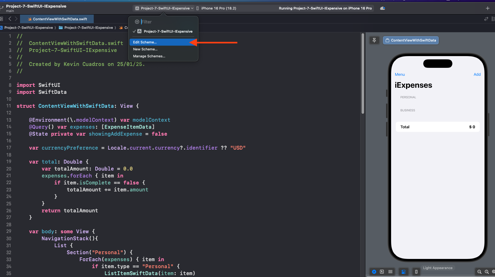
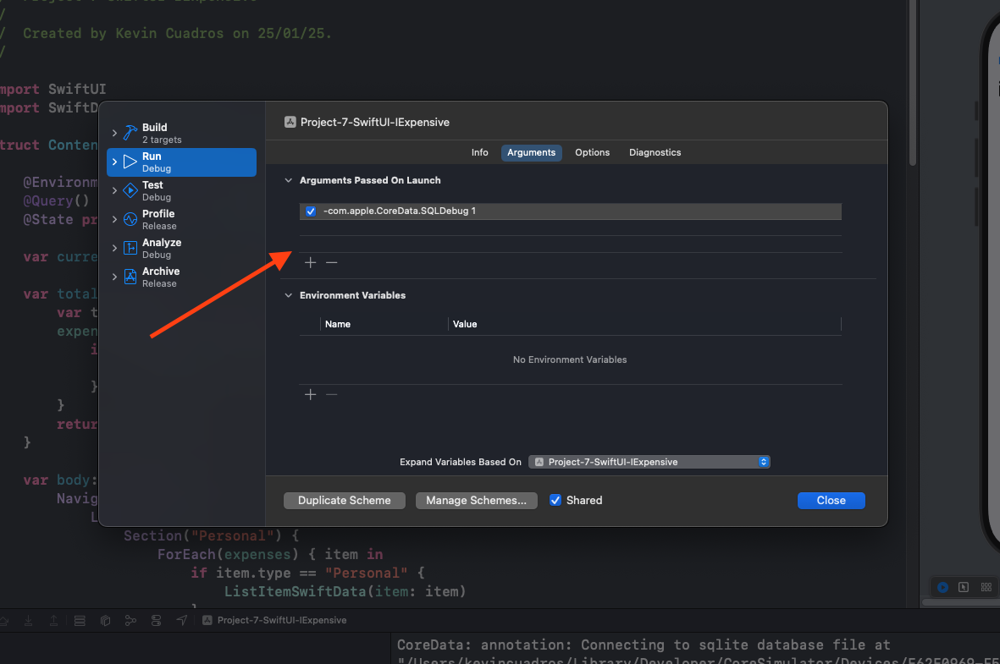
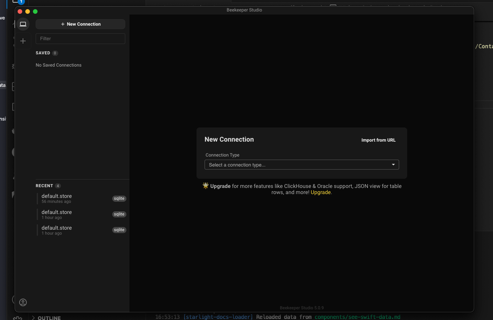
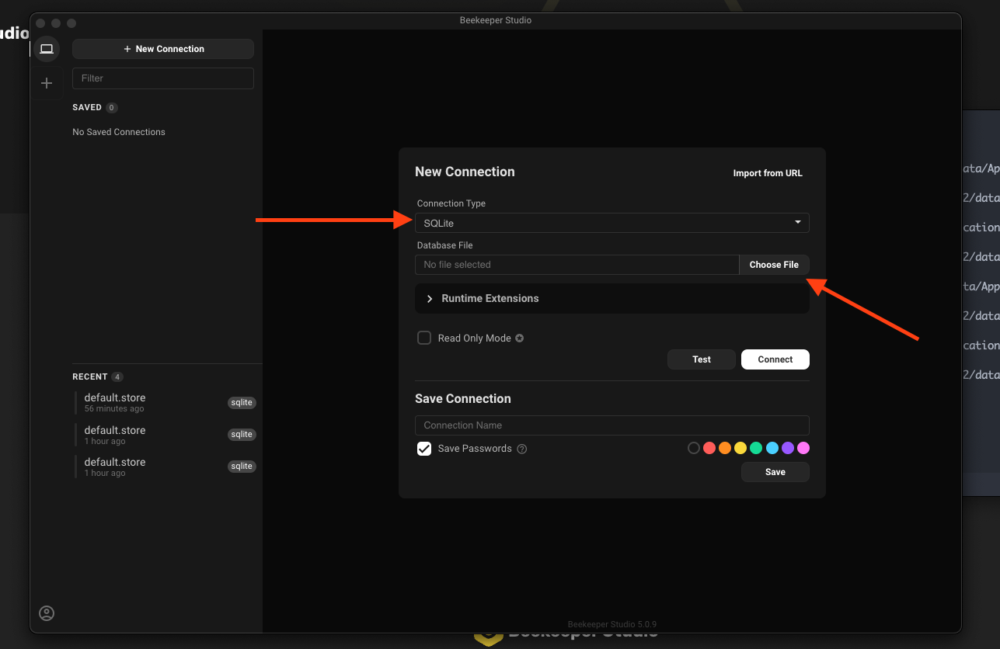
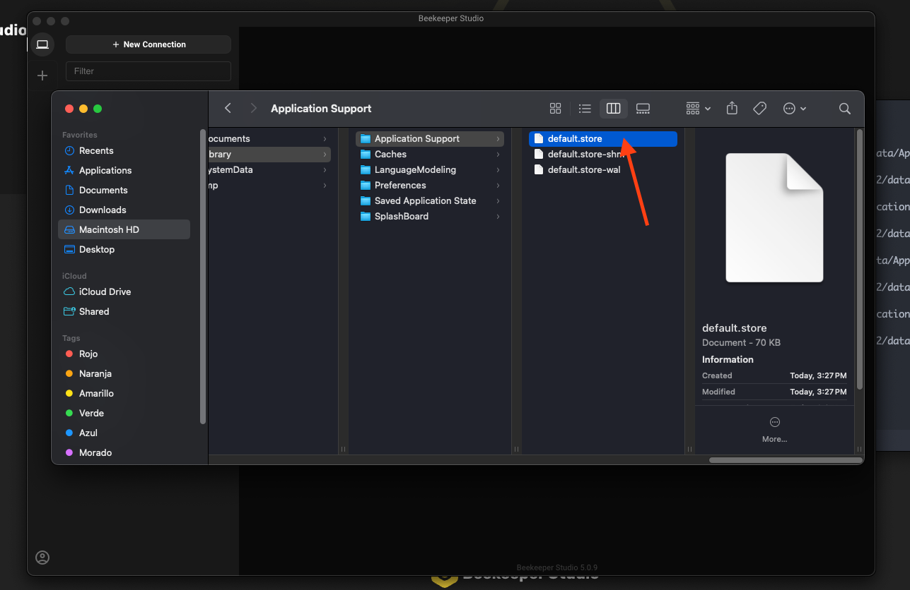
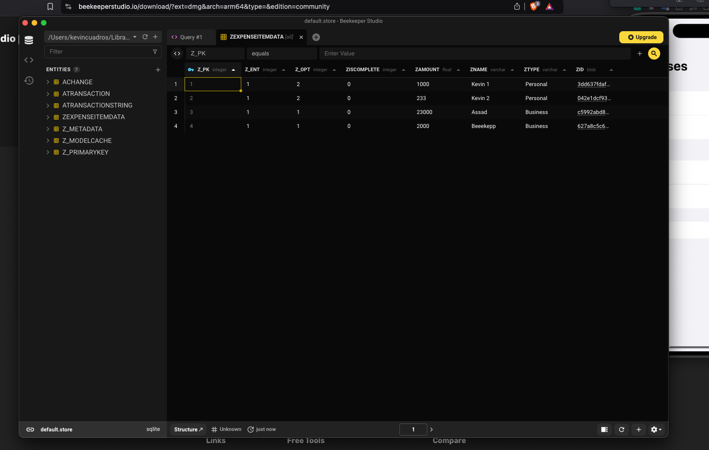

SwiftData is a powerfull layer to work with data in SwiftUI.

## Description

In this tutorial, In this tutorial we are going to learn step by step how to view the information saved in SwiftData


### Visualize the data [Beekeeper](https://www.beekeeperstudio.io/get)


## Step 1: Create a Launch Arguments

To start, we need to create a launch argument to be able to use SwiftData. 

- Select the project in the Project Navigato



- Select Edit Scheme



- Create a new launch argument for example `-com.apple.CoreData.SQLDebug 1`



## Step 2: Copy path of the database

- When you run the app, you will see the following console output

```bash
CoreData: annotation: Connecting to sqlite database file at "/Users/user/Library/Developer/CoreSimulator/Devices/324HU234-JH234JJ23-JM23B4-CD324TF/data/Containers/Data/Application/324HU234-JH234JJ23-JM23B4-CD324TF/Library/Application Support/default.store"
CoreData: sql: SELECT TBL_NAME FROM SQLITE_MASTER WHERE TBL_NAME = 'Z_METADATA'
CoreData: sql: pragma recursive_triggers=1
CoreData: sql: pragma journal_mode=wal
CoreData: sql: SELECT Z_VERSION, Z_UUID, Z_PLIST FROM Z_METADATA
CoreData: sql: SELECT TBL_NAME FROM SQLITE_MASTER WHERE TBL_NAME = 'Z_METADATA'
CoreData: sql: SELECT TBL_NAME FROM SQLITE_MASTER WHERE TBL_NAME = 'Z_MODELCACHE'
CoreData: sql: SELECT TBL_NAME FROM SQLITE_MASTER WHERE TBL_NAME = 'ACHANGE'
CoreData: sql: SELECT TBL_NAME FROM SQLITE_MASTER WHERE TBL_NAME = 'ATRANSACTION'
CoreData: debug: Remote Change Notification - registered core observer for 324HU234-JH234JJ23-JM23B4-CD324TF
CoreData: debug: Remote Change Notification - registered for  com.apple.coredata.NSPersistentStoreRemoteChangeNotification.remotenotification.324HU234-JH234JJ23-JM23B4-CD324TF
```

- Copy the path of the database

```bash
/Users/user/Library/Developer/CoreSimulator/Devices/324HU234-JH234JJ23-JM23B4-CD324TF/data/Containers/Data/Application/324HU234-JH234JJ23-JM23B4-CD324TF/Library/Application Support/
```

## Step 3: Open the database in Beekeeper

- Open Beekeeper



- Select the database `SQLite`
- Select the database path 
- Select the database `default.store`
- Press `Connect` button
 
 

 

## Step 4: View the data

- Select the table 




references:

- [Visualizing SwiftData/Core Data Records](https://www.youtube.com/watch?v=GO2ZA5ZQO-8)